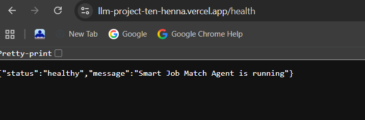
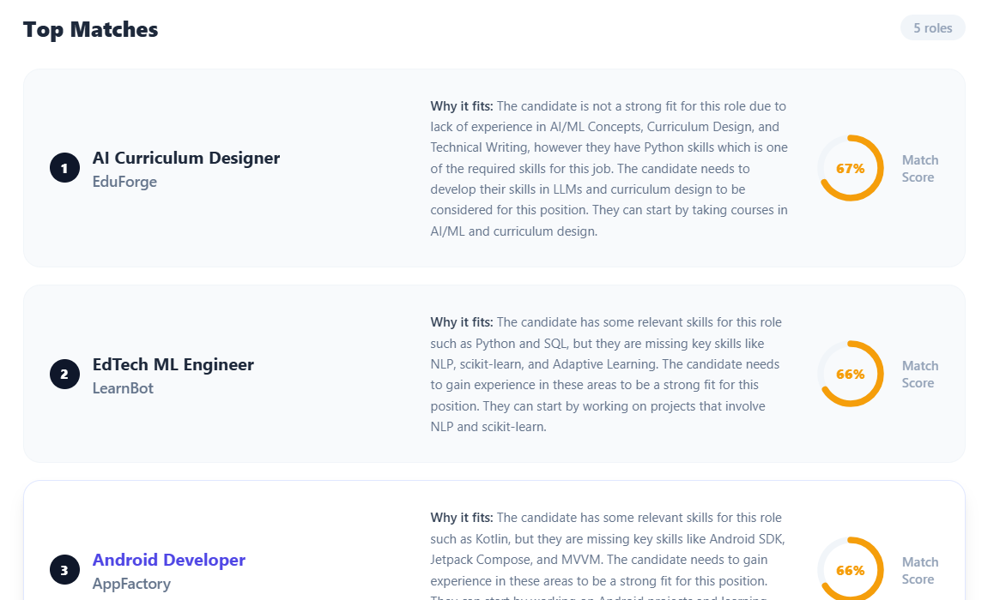
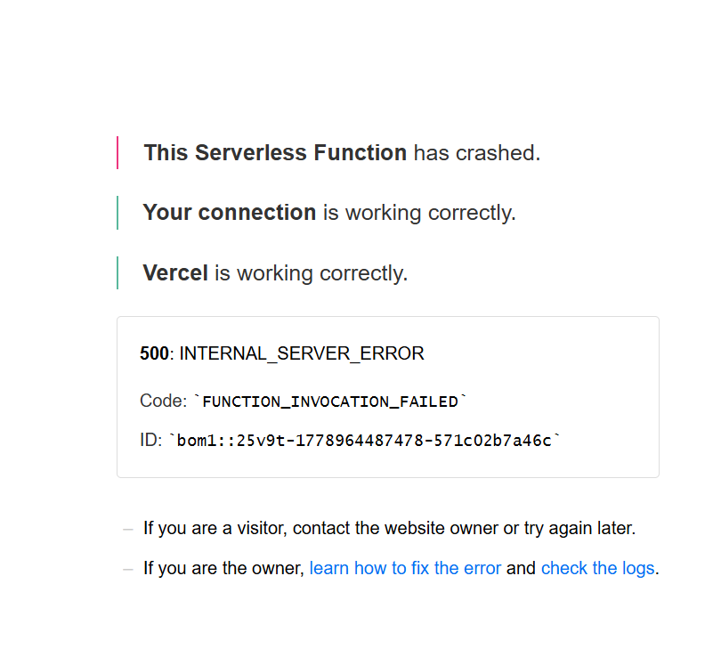

# Smart Job Match Agent: Technical Write-up
**Applicant:** Arshad Ajij Shaikh| D.J. Sanghvi College of Engineering  
**Project:** Cantilever AI Engineering Intern Assignment  

---

### 1. Design Choices
**Embedding Model Selection & Trade-offs**

For the initial semantic ranking phase, I selected the **Cohere API**, specifically utilizing the `embed-english-v3.0` model. 

When designing the architecture, my primary alternative was deploying a local, open-source model using the `sentence-transformers` library (such as `all-MiniLM-L6-v2`). However, deploying a machine learning backend to a serverless environment like Vercel introduces severe hardware constraints, most notably the strict 1024 MB memory limit on the free tier. Loading a local embedding model directly into the FastAPI application memory space risks persistent Out-Of-Memory (OOM) crashes. Furthermore, serverless environments suffer from cold starts; loading a local ML model into memory on the first request would easily introduce 2–5 seconds of latency, risking Vercel’s execution timeouts.

**The Trade-off:** I explicitly traded local execution (which avoids network latency and API dependency) for cloud-based memory safety and execution speed. By offloading the heavy vectorization to Cohere, the Vercel backend only has to handle a highly efficient NumPy dot product operation to calculate cosine similarity. This guarantees the serverless function executes rapidly, remaining well under Vercel’s 60-second timeout while avoiding the 1024 MB memory ceiling entirely.

---

### 2. Agentic Architecture
**Tool-Calling Flow**

The agentic layer utilizes Groq’s `llama-3.3-70b-versatile` model, interacting exclusively through native JSON tool-calling rather than prompt chaining. The flow is decoupled into two distinct stages:

1. **Extraction (`extract_candidate_info`):** The raw resume string is passed to the LLM bound to a strict JSON schema. The tool forces the LLM to output structured data: name, skills, experience_years, preferred_roles, and education.
2. **Ranking (Classical ML):** The extracted text is embedded via Cohere and compared against the pre-embedded `jobs.json` dataset using cosine similarity to find the top 5 matches.
3. **Reasoning (`provide_match_reasoning`):** The structured candidate profile and the top 5 matched jobs are passed to a second tool. This tool forces the LLM to generate targeted, 2-3 sentence evaluations comparing the specific skills of the candidate against the requirements of the job.

**Why split into two tools?**
I split this into two distinct tool calls to maintain strict data integrity and prevent context window bloating. If a single monolithic prompt attempted to parse the resume, perform keyword comparisons, and write reasoning simultaneously, the LLM would be highly susceptible to hallucination—often outputting malformed JSON or inventing skills. Decoupling ensures the mathematical vector search is grounded in cleanly extracted data *before* any qualitative reasoning occurs.

**Failure Modes:**
The primary failure mode of this design is external API latency. Any rate-limiting or network degradation from the Groq or Cohere APIs will cause the FastAPI server to hang, eventually triggering a 500 Internal Server Error when Vercel drops the connection. Additionally, if the LLM encounters a highly abstract, unreadable resume format, it may fail to bind to the `extract_candidate_info` JSON schema correctly, triggering a Pydantic validation exception.

---

### 3. Honest Weaknesses

**Handling Noisy Resumes**
The system currently relies on basic text extraction (like `PyPDF2`) to parse candidate uploads. This approach strips out visual hierarchies, tables, and layout context. If a candidate uploads a highly graphical, multi-column resume, the text extraction will yield scrambled, fragmented strings. This "garbage-in" data will confuse the Groq extraction tool and result in a highly inaccurate Cohere semantic embedding, destroying the match quality.

**Breaking at Scale (10,000 Concurrent Requests)**
At scale, this architecture would break at the similarity computation layer. Currently, the cosine similarity is calculated in-memory using `np.dot` over the parsed `jobs.json` array. While O(N) linear time is highly performant for 50 jobs, executing 10,000 concurrent matrix multiplications in-memory for thousands of job listings would instantly exhaust Vercel's CPU and 1024 MB RAM limit, causing cascading server crashes.

**Corners Cut:**
Due to time limits, I skipped implementing an advanced Document AI parser (like AWS Textract) capable of reading visual resume layouts. I also bypassed implementing a persistent caching layer (like Redis) for the job embeddings, meaning the system redundantly recalculates identical job descriptions instead of pulling them from a cache.

---

### 4. Next Steps

If I had two more days, the single improvement with the highest impact would be integrating a dedicated **Vector Database** (such as Pinecone, Milvus, or Qdrant). 

Currently, reading `jobs.json` into memory and running NumPy math on every POST request is a severe architectural bottleneck that prevents scaling. Migrating the job embeddings to a persistent Vector DB would shift the heavy computational lifting off the Vercel server and enable Approximate Nearest Neighbor (ANN) search. This would drop retrieval latency to sub-milliseconds, solve the memory limit constraints, and allow the platform to instantly scale to handle hundreds of thousands of concurrent users and millions of job listings without degrading performance.
